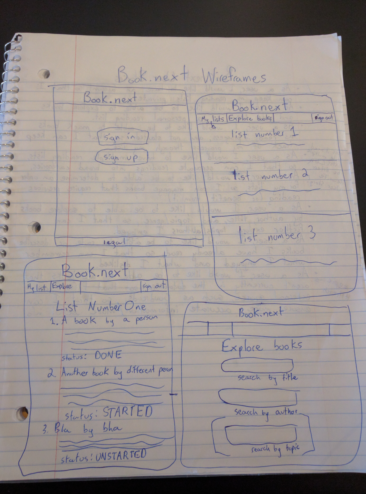

# Book.next

A web app for managing your personal reading lists. Users should create an account if they do not already have one, and then go to the "Explore Books" screen to find books they would like to read. If the book they are looking for does not exist, they can add it to the database. Once they have a reading list, users can mark each book as unread, started, or read, or they can remove books from the list.

Interacts with an API at [this gitHub repository](https://github.com/Sofistication/reading-list-api).

## User Stories

- [x] As a user, I want to have an account so that I can track my reading list and keep it private.
- [x] As a user, I would like to be able to explore books so that I can add them to my personal reading list.
- [x] As a user, I would like to be able to mark books as read, in progress, and unstarted so that I can keep track of my progress through my list.
- [x] As a user, I would like to be able to explore books by author, title, so that I can further explore authors I previously enjoyed.
- [ ] As a user, I would like to have multiple reading lists, so that I can sepearate my readings into broad categories.
- [ ] As a user, I would like to be able to determine an order for my reading lists, so that I can make sure I am reading books that build on each other in a beneficial order.
- [ ] As a user, I would like to be able to rate or describe books I have read, so that I can remember what I enjoyed and what I disliked.
- [ ] As an administrator, I would like users to add new books to the database from an external source, so I can ensure accuracy of information.

## Wireframes

## Design Approach

In designing this app, I began by creating the most basic version of the API, and then began to code the client. As the needs of the client surpassed the capabilities of the API, I went back and added in the necessary functionality.
